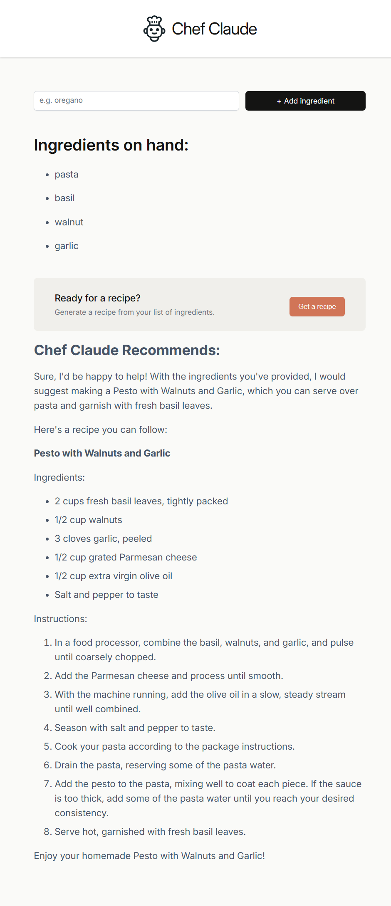

# 🍳 AI Recipe Generator

A small but mighty React-based web app that lets users input ingredients and receive a recipe recommendation generated by an AI model. Whether you're staring at a fridge full of mystery items or just feeling adventurous, this app will whip up something delicious.

---

## 🚀 Features

- Input any list of ingredients  
- Sends a request to an AI model to generate a recipe suggestion 
- Clean and simple React frontend  
- Markdown rendering of recipe responses

---

## 🛠️ Tech Stack

- **React** – UI built with functional components  
- **React Markdown** – To render AI-generated recipe in readable format  
- **Hugging Face Inference API** – For AI-powered recipe generation  
- **Optional:** Anthropic Claude 3 API integration (commented out)  
- **CSS** – For responsive styling

---

## 🧠 AI Model Integration

The app supports generating recipes via different AI models:

- **Hugging Face Inference API** – Uses [`mistralai/Mixtral-8x7B-Instruct-v0.1`](https://huggingface.co/mistralai/Mixtral-8x7B-Instruct-v0.1) to generate creative recipe responses based on user-input ingredients.
- **(Optional)** Anthropic Claude 3 Haiku – Code is included but commented out by default. Easily switch between models by uncommenting the relevant section and providing your API key.

### System Prompt

All model calls include a consistent system prompt to ensure markdown formatting and focused, useful recipe suggestions:

```
You are an assistant that receives a list of ingredients that a user has and suggests a recipe they could make with some or all of those ingredients...
```

### 🔐 Environment Variables

Be sure to define your API keys:

```env
VITE_HF_ACCESS_TOKEN=your_huggingface_token
ANTHROPIC_API_KEY=your_anthropic_token
```

Update your `.env` file or environment settings accordingly.

---

## 📸 Screenshots

### 🔹 AI-Generated Recipe


---

## ⚙️ Getting Started

### Prerequisites

- Node.js
- npm 
- An API key or endpoint for your AI model

### Environment Setup

To run this app, create a `.env` file in the root and add your API key:

```env
VITE_HF_ACCESS_TOKEN=your_token_here
```
or
```env
ANTHROPIC_API_KEY=your_token_here
```

### Installation

```bash
git clone https://github.com/raziie/ai-recipe-generator.git
cd ai-recipe-generator
npm install
npm run dev
```
---

## 🧠 Future Improvements

- Add option to choose cuisine type  
- Export recipes as PDF or text  
- Add image suggestions via AI  
- Voice input for ingredients